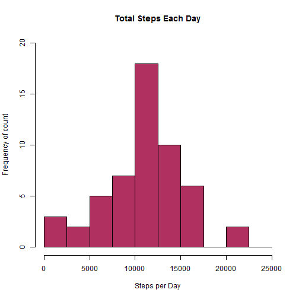
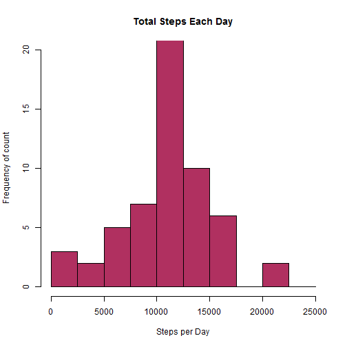
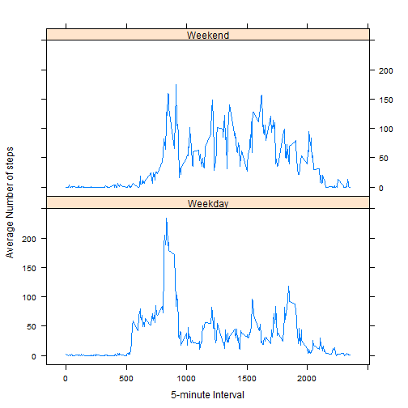

##Reproducible Research: Peer Assessment 1
This assignment makes use of data from a personal activity monitoring device. This device collects data at 5 minute intervals throughout the day. The data consists of two months of data from an anonymous individual collected during the months of October and November, 2012 and include the number of steps taken in 5 minute intervals each day.

###Data
The data provided for the assignment is stored in a comma-separated-value (CSV) file and there are a total of 17,568 observations in this dataset.
The variables included in this dataset are:

- **steps**: Number of steps taking in a 5-minute interval (missing values are coded as NA)

- **date**: The date on which the measurement was taken in YYYY-MM-DD format

- **interval**: Identifier for the 5-minute interval in which measurement was taken

###Loading and preprocessing the data


```r
# Set current working directory where the downloaded file exists

setwd("D:/Data specialist course/Reproducible research/Peer Review/Assignment 1")

# If datafile does not exist in the directory, unzip the file
if(!file.exists("activity.csv"))
{
    unzip("repdata-data-activity.zip", "activity.csv")
}

#Read it to a data set with name ActivityData

ActivityData <- read.csv("activity.csv")
names(ActivityData)
```

```
## [1] "steps"    "date"     "interval"
```

```r
# convert date to date data type
ActivityData$date <- as.Date(ActivityData$date) 
# Display top 6 records
head(ActivityData)
```

```
##   steps       date interval
## 1    NA 2012-10-01        0
## 2    NA 2012-10-01        5
## 3    NA 2012-10-01       10
## 4    NA 2012-10-01       15
## 5    NA 2012-10-01       20
## 6    NA 2012-10-01       25
```

###Calculating Mean total number of steps taken per day

####1. Calculate the total number of steps taken per day, ignoring the NA values

```r
StepsPerDay<- aggregate(steps ~ date, ActivityData, sum, na.rm=TRUE)
```
####2. Create histogram of the total number of steps taken each day

```r
  hist(StepsPerDay$steps, breaks=seq(from=0,to=25000,by=2500),
       col="maroon",
       main="Total Steps Each Day",  
       xlab="Steps per Day",
       ylab="Frequency of count",
       ylim = c(0,20))
```

 

####3.Calculate and report the mean and median of the total number of steps taken per day

```r
mean(StepsPerDay$steps)
```

```
## [1] 10766.19
```

```r
median(StepsPerDay$steps)
```

```
## [1] 10765
```
## Calculating and plotting the average daily activity pattern?
#
####1.Time series plot (i.e. type = "l") of the 5-minute interval (x-axis) and the average number of steps taken, averaged across all days (y-axis)


```r
StepsByInterval <- aggregate(steps ~ interval, ActivityData, mean)

plot(StepsByInterval$interval, StepsByInterval$steps, type="l", xlab="Interval", ylab="Number of Steps",main="Average Number of Steps per Day by Interval")
```

 

####2. 5-minute interval which contains the maximum number of steps, on average across all the days in the dataset

```r
MaxValue <-StepsByInterval[which.max(StepsByInterval$steps),1]
paste("5-minute interval which contains the maximum number of steps",MaxValue)
```

```
## [1] "5-minute interval which contains the maximum number of steps 835"
```
##Imputing missing values

####1. Calculate and report the total number of missing values in the dataset (i.e. the total number of rows with NAs)

```r
paste("Total number of missing values in the dataset =",sum(is.na(ActivityData)))
```

```
## [1] "Total number of missing values in the dataset = 2304"
```

####2. Devise a strategy for filling in all of the missing values in the dataset.

The strategy is to fill with the mean for that 5-minute interval

####3. Create a new dataset that is equal to the original dataset but with the missing data filled in.


```r
IntervalMean <- aggregate(steps ~ interval, data=ActivityData, mean)
ActivityDataNew <- ActivityData
for (i in 1:nrow(ActivityDataNew)) 
{
   if (is.na(ActivityDataNew[i,1]))
   {
        for (j in 1:nrow(IntervalMean))
        {
            	if(IntervalMean[j,1] == ActivityDataNew[i,3])
              {
		              ActivityDataNew[i,1]<-IntervalMean[j,2]
	            }
	       } # end of j loop
   }
} # end of i loop

paste("Total number of missing values in the dataset after the filling = ", sum(is.na(ActivityDataNew)))
```

```
## [1] "Total number of missing values in the dataset after the filling =  0"
```
####4. Make a histogram of the total number of steps taken each day and Calculate and report the mean and median total number of steps taken per day. 


```r
StepsPerDayNew<- aggregate(steps ~ date, ActivityDataNew, sum)
hist(StepsPerDayNew$steps, breaks=seq(from=0,to=25000,by=2500),
     col="maroon",
     main="Total Steps Each Day", 
     xlab="Steps per Day",
     ylab="Frequency of count",
     ylim=c(0,20))
```

 

```r
paste("Mean of the new dataset = ",mean(StepsPerDayNew$steps))
```

```
## [1] "Mean of the new dataset =  10766.1886792453"
```

```r
paste("Median of the new dataset = ",median(StepsPerDayNew$steps))
```

```
## [1] "Median of the new dataset =  10766.1886792453"
```
####Do these values differ from the estimates from the first part of the assignment? 


```r
paste(" Difference between the means = ",mean(StepsPerDay$steps)-mean(StepsPerDayNew$steps) )
```

```
## [1] " Difference between the means =  0"
```

```r
paste(" Difference between the medians = ",median(StepsPerDay$steps)-median(StepsPerDayNew$steps) )
```

```
## [1] " Difference between the medians =  -1.1886792452824"
```
####What is the impact of imputing missing data on the estimates of the total daily number of steps?

#### There is no major impact on imputing missing data. The histograms are nearly equal. The means are same and there is small difference in median value

###Are there differences in activity patterns between weekdays and weekends?
####Create a new factor variable in the dataset with two levels - "weekday" and "weekend" indicating whether a given date is a weekday or weekend day


```r
day <- weekdays(ActivityData$date)
daylevel <- vector()
for (i in 1:nrow(ActivityData))
{
    if ( (day[i] == "Saturday") || (day[i] == "Sunday"))
    {
        daylevel[i] <- "Weekend"
    } else {
        
          daylevel[i] <- "Weekday"
    	    }
}
ActivityData$daylevel <- daylevel
ActivityData$daylevel <- factor(ActivityData$daylevel)
```

####Created a plot to compare and contrast number of steps between the week and weekend. 

####There is a higher peak earlier on weekdays and higher overall activity during  weekends.


```r
stepsByDay <- aggregate(steps ~ interval + daylevel, data = ActivityData, mean)
names(stepsByDay) <- c("interval", "daylevel", "steps")

library("lattice")
xyplot(steps ~ interval | daylevel, stepsByDay, type = "l", layout = c(1, 2), xlab = "5-minute Interval", ylab = "Average Number of steps")
```

 

####Even though there is a higher peak during weekdays during the early period, there is higher overall activity during  weekends throughout the duration.

